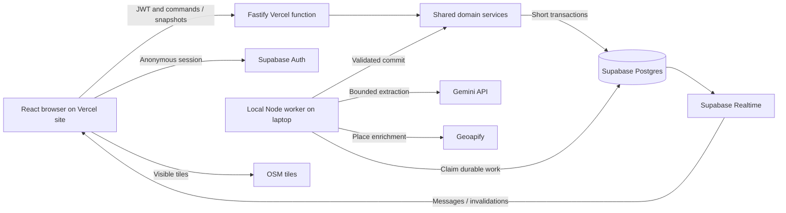

# Group Trip Planner Architecture

Status: architect's implementation handoff, 2026-09-12. Kartik retains final technical and product authority. This document contains architecture, not application code.

Product input: [trip-planner-v1.md](.claude/agents/trip-planner-v1.md). The resolutions below explicitly amend conflicting parts of that specification. Implement the resolved contract, not a mixture of contradictory rules. Surface further material changes to Kartik. `plan.md` remains authoritative for assignments and progress.

## 1. Review Findings

The product has a useful MVP boundary, but the original architecture was an empty template. These issues require explicit resolution before implementation.

| Severity | Product reference and gap | Decision |
| --- | --- | --- |
| P1 | Sections 4, 8.2: localStorage person IDs can be impersonated, defeating own-budget/attendance permissions. | Anonymous Supabase sessions identify the browser. Server-verified identity owns membership; submitted person IDs never authenticate. |
| P1 | Sections 5, 11: timestamp-only locks cannot stop expired workers from committing after takeover. | Durable batches, expiring leases, unique ownership tokens, and token checks in the commit transaction. |
| P1 | Sections 4, 11: bigserial allocation order is not commit order; a late commit can fall behind the watermark. | Every message writer locks the trip before allocating an ID. Each batch captures a fixed upper message boundary. |
| P1 | Sections 5, 10: operations alone do not protect human edits; malformed JSON cannot be validated per operation. | Compare captured calendar version at commit; re-extract on mismatch. Unparseable envelopes fail without consuming messages. |
| P1 | Section 6.5: create-plus-deassign moves can partially succeed and lose attendance or the original event. | Replace with one atomic reschedule_event operation preserving event ID and attendance. |
| P1 | Sections 6.3, 6.6: two IDs do not establish two people's consent; old context can repeatedly enroll people. | Require authored evidence, a current-batch trigger for every operation, and protection for human attendance choices. |
| P1 | Sections 3, 8.6: tracks are both derived and said to have stored colors; three concurrent events does not mean three daily paths. | Persist person colors; derive paths and shared segments once on the server for both views. |
| P1 | Sections 7, 10: live enrichment cannot be synchronous and instant; missing place/price data cannot imply feasibility or zero cost. | Network enrichment is asynchronous; deterministic checks use stored data and report unknown coverage. |
| P2 | Sections 6.4, 7.4: label-only tombstones conflate visits; revival and Undo lack consent/revision rules. | Tombstones retain occurrence, aliases, and deletion provenance; fresh consent and revision-bound Undo are required. |
| P2 | Sections 2, 8.4: three-event concurrency and unique colors have no enforcement/capacity rule. | Transactional maximum of three overlapping live events; maximum 12 members and a fixed 12-color palette. |
| P2 | Sections 4, 8.1: wizard fields, currency, inclusive dates, midnight, and DST are underspecified. | Persist group/headcount; USD-only; one to seven inclusive dates; one IANA zone; reject overnight and ambiguous/nonexistent local times. |
| P2 | Section 10: hidden LLM failure leaves the user unable to know whether updates ran. | Persist failure and show Retry while manual workflows remain available. |

These are deliberate amendments. Anonymous authentication adds no account form, email, or password. Atomic rescheduling changes the original four-operation contract to five operations. The source product document is preserved so these changes remain reviewable.

## 2. Scope and Defaults

- Desktop-first; one destination, one timezone, USD, and one to seven dates inclusive. End minus start is zero through six calendar days.
- Maximum 12 actual members, 100 live events, 2,000 characters per user chat message, and 10,000 user messages per trip. Enforce named configuration limits server-side. Reject further user submissions at capacity without preventing required bounded audit/bot writes or deleting history.
- Expected headcount is informational, 1 through 12. It does not reserve colors or block joining before that count; the actual member limit does.
- All members may edit shared event details and delete events. Only self may edit personal budget and manual attendance. No host moderation/member removal in MVP.
- Manual event creation includes its creator as attending. Automatic creation requires two distinct consenting members. Never create an empty event.
- Trip destination, dates, timezone, and currency are immutable after creation; names may change. Date migration is a separate future workflow.
- No unscheduled-ideas tray or proposal table. Unschedulable/ambiguous requests produce a bounded clarification linked to their source message. Stored chat is never deleted by processing. Explicit replies can retrieve old proposals outside ordinary context, but arbitrary unreferenced historical ideas are not promised permanent model memory.
- Cold start is the actual empty chat with invite sharing and manual Add event available. Do not inject fake agreement into real trips. Demo seed data creates a separate trip.
- This is a constraint-checking planner, not a globally optimal itinerary solver. Haversine estimates cannot prove real-world feasibility.

## 3. Stack and Deployment

Use a modular monolith: one repository, one database, and shared domain rules with separate HTTP and worker entry points. For the controlled demo, deploy the UI/API on Vercel and run the worker on the presenter's laptop.

Confirmed by Kartik: retain Supabase Postgres for persistence, Supabase anonymous Auth and Realtime, and Gemini for LLM extraction. The database comparison is closed.

| Concern | Choice | Reason |
| --- | --- | --- |
| Language/tooling | Strict TypeScript, npm workspaces, pinned Node LTS and dependency lockfile | Shared contracts and reproducibility; resolve compatible versions during skeleton setup. |
| UI | React + Vite, React Router, TanStack Query, Tailwind CSS, Lucide | Stateful application without server-rendering requirements. |
| Calendar | FullCalendar Standard React integration, TimeGrid | Existing time-grid/overlap behavior. No premium resource scheduler. |
| Map | Leaflet, ordinary interactive OpenStreetMap raster tiles | Stored coordinates and server-derived paths; no routing service. |
| HTTP | Fastify as a Vercel Node function; Vite static assets and /api routed on one origin | Request-driven API only; Vite proxies API during local development. No scheduler is started by importing the HTTP entry point. |
| Validation/database access | Zod, Drizzle schema/migrations, pg transactions | Typed boundaries and explicit relational transactions/row locks. |
| Persistence/identity | Supabase Postgres and anonymous Auth | Attendance relations, atomic batches, and identity without account forms. |
| Realtime | Supabase Postgres Changes on trip and message | Invalidation and message notifications; HTTP snapshots are authoritative. |
| Extraction | Gemini API through the official Google GenAI TypeScript SDK (@google/genai), with structured JSON output | Uses the team's provided Gemini access; one bounded call per attempt behind one adapter. |
| Place enrichment | Geoapify geocoding and Place Details; seed/manual overrides | Cached coordinates and available hours; no assumed universal pricing API. |
| Time/export | Luxon, opening_hours parser, ical-generator | Existing timezone, opening-hours grammar, and calendar serialization logic. |
| Verification | Vitest, real Postgres integration tests, Playwright | Rules, transactions, and two-browser collaboration. |
| Hosting | Vercel Hobby for UI/API, hosted Supabase, one local Node worker | Controlled-demo setup: laptop worker performs scheduled extraction/enrichment while Vercel serves participants. |

Pin a compatible Gemini structured-output model available to the provided project in `LLM_MODEL`, record it per batch, and gate changes on extraction evaluations. Prefer a Flash-family candidate for the initial latency/cost evaluation; use a more capable available model only if the consent/extraction corpus shows a meaningful improvement. Do not assume a model identifier, quota, or latest alias from another account. Pin library versions together; do not copy imports across incompatible major versions. Use the official SDK. [Google GenAI libraries](https://ai.google.dev/gemini-api/docs/libraries).

FullCalendar's standard plugins are MIT licensed; premium plugins have different terms. [FullCalendar license](https://fullcalendar.io/license). Anonymous Supabase sessions provide identity, but cleared storage, sign-out, or a new device loses access without account linking. [Supabase anonymous sign-ins](https://supabase.com/docs/guides/auth/auth-anonymous).

Use small pg pools through supported Supabase pooled connections: transaction pooling for the Vercel function and direct/session pooling for the persistent local worker. Keep each transaction on one checked-out connection and avoid session-dependent features or unsupported prepared-statement behavior on transaction pooling. [Supabase connections](https://supabase.com/docs/guides/database/connecting-to-postgres). No Redis, external queue, independently implemented microservices, vector store, autonomous tool-using agent, or browser-owned scheduler. Vercel instances and overlapping worker restarts must still be safe through database coordination.

### Controlled-Demo Hosting

The local worker connects outbound to hosted Supabase, Gemini, and Geoapify. Vercel and participants never connect to localhost, so no tunnel or public laptop port is needed. Run the worker from the same source revision as the deployed API, using its own server-only environment. Only the worker runs the two-second scheduler, extraction, and queued enrichment. Vercel handlers persist due work and return; they never rely on timers or unawaited work surviving an HTTP response.

Keep the laptop awake, online, and the worker process running during the demo. Closing browser tabs does not stop it; sleep, shutdown, or losing connectivity does. Pending jobs remain in Postgres and resume when the worker returns. Hosted chat/manual planning continue while the worker is down. Update plan queues work and cannot bypass an offline worker; show that state honestly.

Vercel Hobby is intended for personal/non-commercial use within its included limits. Fastify can run as a Vercel function; the deployment must route built static assets and API requests correctly and pass a deployed smoke test. No Railway account is required for this demo. [Vercel Hobby](https://vercel.com/docs/plans/hobby), [Fastify on Vercel](https://vercel.com/docs/frameworks/backend/fastify).

Supabase Cron is a viable later replacement for the laptop scheduler, not a second scheduler to run alongside it. It can periodically check due database work and invoke an authenticated, bounded processing function. Adopting it requires replacing the persistent worker entry point with request-bounded jobs, configuring a protected endpoint/secret, and enforcing database-wide concurrency limits. The lease/watermark/domain contracts remain the same. Vercel Hobby's built-in once-daily cron cannot implement the demo inactivity timer. [Supabase Cron](https://supabase.com/docs/guides/cron), [Vercel cron limits](https://vercel.com/docs/cron-jobs/usage-and-pricing).

Turnstile is deferred for local development and the controlled demo. Before broadly sharing the application, integrate and enable anonymous-signup CAPTCHA. This does not remove membership authorization, RLS, or provider usage ceilings from the demo.

### Database Decision: Postgres Confirmed

Kartik confirmed retaining Postgres after evaluating MongoDB. The comparison below records the decision rationale only; it is not an alternative implementation contract. Gemini remains the selected LLM provider.

MongoDB can atomically update one document and supports multi-document transactions on replica sets/sharded deployments. An Atlas deployment supporting those features can preserve the batch/calendar/audit guarantees; a standalone local mongod would not be an adequate test environment. [MongoDB atomicity](https://www.mongodb.com/docs/manual/core/write-operations-atomicity/), [MongoDB transactions](https://www.mongodb.com/docs/manual/core/transactions/).

| Concern | Current Postgres/Supabase design | MongoDB implications |
| --- | --- | --- |
| Calendar model | Related event, member, and attendance rows with constraints | A bounded trip-plan document can embed live events/rosters; keep growing chat, batch, and audit history separate. Bound document size explicitly. |
| Consistency | Trip row lock, foreign keys, unique constraints, transaction/savepoint protocol | Conditional revision updates, transaction retries, unique indexes, collection validators, and server-enforced cross-document membership. The SQL savepoint approach must be redesigned, not translated mechanically. |
| Ordered processing | Message IDs allocated after trip lock | Explicit per-trip sequence allocated with message insert in the same transaction; ObjectId/timestamps do not define the watermark. |
| Realtime | Membership-filtered Supabase subscriptions | Server consumes change streams and forwards authorized invalidations/messages through SSE or WebSockets, retaining HTTP catch-up. Change streams are not a browser authorization layer. |
| Guest identity | Supabase anonymous Auth plus Postgres membership | Keep Supabase Auth as a separate identity provider and check membership in MongoDB, or separately choose a replacement session system. MongoDB alone does not replace this application identity flow. |

MongoDB change streams support server-side change notifications; the application still owns browser delivery, membership checks, reconnection, and recovery when a resume token can no longer be used. [MongoDB change streams](https://www.mongodb.com/docs/manual/changestreams/). Database transaction callbacks may retry: provider calls and browser emissions must remain outside them. [MongoDB Node transactions](https://www.mongodb.com/docs/drivers/node/current/crud/transactions/).

Decision rationale: Postgres/Supabase supplies the relational constraints and managed auth/realtime used throughout this design. Performance at 12 members/100 live events did not justify replacing that integration. Implementation agents should follow the Postgres persistence, mutation, and authorization contracts in this document.

## 4. Component Boundaries

| Boundary | Owns | Must not do |
| --- | --- | --- |
| apps/web | Wizard/join/chat/calendar/budget/map, drafts, status, query cache, realtime reconciliation | Direct database writes, provider calls, authoritative business-rule calculations |
| apps/server HTTP | Authentication, membership authorization, validated commands, snapshots/export, rate limits | Duplicate domain logic in route handlers |
| apps/server domain | Event/attendance mutations, human precedence, revisions, constraints, warnings, projections, audit | Network requests or trusting model output as authorization |
| apps/server jobs | Local worker entry point, due-work polling, leases, provider calls, validation, retry/commit coordination | Start from the Vercel HTTP entry point, hold SQL locks during provider calls, or keep the only job copy in memory |
| packages/contracts | Request/response/operation schemas, error codes, shared configuration types | Server credentials, database connections, provider SDKs |
| packages/db | Schema, migrations, query helpers, constraints, RLS | Alternative mutation pathways that bypass domain rules |

HTTP commands and batch operations call the same domain functions. Database state is authoritative; model calendar JSON and UI state are projections. Query cache owns fetched state; UI-local state owns selection, drafts, and open views.

## 5. Identity and Authorization

1. Obtain a Supabase anonymous session before create/join. SDK-managed session persistence is the identity mechanism; a cached trip/person ID is convenience only.
2. Send the access token with HTTP requests. The server verifies it through Supabase Auth, never merely decodes it. Derive self from verified auth user plus trip membership.
3. Enforce unique membership for trip/auth user. The same session reopening an invite returns its membership. A new device is a new identity; matching display names never recovers another person's membership.
4. Create trip, creator membership, and invite atomically. Joining locks the trip, validates the invite, checks capacity, and assigns the first unused immutable palette index.
5. Invites contain at least 128 random bits encoded URL-safe. Store hashes in a server-private table. Use an invite fragment, exchange it through HTTPS, and remove it from browser history after use. Any member may mint a link; creator-only rotation revokes existing links without ejecting members.
6. Every object reference is checked against the trip: events, people, places, source messages, tombstones, and bot actions.
7. Members can see all member budgets/attendance. Only self can edit personal budget/manual attendance or download their own calendar.
8. Human attendance supports in, out, and undecided. Human in/out cannot be overwritten by extraction; setting undecided removes the row and explicitly releases protection.

Enable RLS on every exposed table. Browser roles have no INSERT/UPDATE/DELETE grants or executable mutation RPCs. Only trip and message need browser SELECT for realtime, restricted to membership via auth.uid(). Keep job/receipt/invite/provider records private. Membership lookup must be nonrecursive; any security-definer helper has fixed search path, minimum grants, and an authenticated-user check.

Use a server-only database credential with scoped grants; API authorization is still mandatory because privileged database access does not establish membership. Migration credentials are separate. Publish only intended trip/message changes; avoid physical deletes. Postgres Changes honors SELECT visibility under RLS. [Supabase Postgres Changes](https://supabase.com/docs/guides/realtime/postgres-changes).

Apply TLS, same-origin CORS, CSP, body limits, and plain-text chat rendering. Never render user HTML, fetch arbitrary chat URLs, or expose secrets in browser bundles. Redact tokens, invites, database URLs, and full prompts from logs. Configure anonymous-signup abuse protection before public exposure.

## 6. Data Contract

Entity IDs are UUIDs except message IDs and counters. Serialize database bigint cursors/versions as decimal JSON strings, never JavaScript numbers. Use integer cents with price/budget range 0 through 100,000,000 cents. Coordinates must be finite and valid. Operational timestamps are UTC timestamptz.

### Core Records

| Record | Required state and invariants |
| --- | --- |
| trip | Product fields, group_name, expected_headcount, destination center/bounds, timezone, currency=USD, creator auth ID, calendar_version, last_processed_msg_id, last_user_msg_id, last_user_message_at, next_process_at, process_requested, processing status, lease token/expiry, retry metadata. Cursors/version initialize to zero. |
| person | Trip, auth user, display name, immutable color_index, budget_cents, timestamps. Unique trip/auth user and trip/color. Duplicate display names are allowed; IDs disambiguate. |
| trip_invite | Trip, token hash, creator, creation/expiry/revocation time. Not in group snapshots. |
| message | Ordered ID, trip, nullable person author, user/bot/system kind, body, typed metadata, optional reply_to_message_id/referenced_event_id, client nonce, batch ID, timestamp. User requires same-trip author; bot/system author is null. Immutable in MVP. |
| place | Trip, label/normalized aliases, provider identity/address, nullable coordinate pair, resolution state, revision, hours/provenance, optional seed price/provenance, fetched time, enrichment due/lease metadata. Coordinates are both present or both absent. |
| event | Trip, stable ID, nullable place, label/normalized aliases, local date/start/end minute, canonical starts_at/ends_at, nullable price_cents/source, human/llm creation source, schedule_locked_by_human, revision, creation/evidence references, timestamps, soft-delete reason/time. Price sources are seeded/estimate/confirmed; price and source are either both null or both set. |
| attendance | Trip, event, person, in/out state, human/llm setter, evidence for model writes, timestamp. Unique event/person; absence is undecided. Composite foreign keys enforce same-trip references. |
| tombstone | Stable ID, trip, original event, occurrence date, place if resolved, original/current aliases, deleting person/time, optional clearing batch/time. Keep history on revival rather than deleting the row. |

Event start/end minutes are within 0 through 1440 with start less than end; 1440 is end-of-day only. An event may end at the following midnight but cannot extend into the next day. Reject ambiguous/nonexistent local times at DST changes instead of choosing an offset silently. Derive UTC instants server-side and enforce consistency with local fields/zone. Intervals are half-open; touching endpoints do not overlap.

Normalize labels with Unicode normalization, case folding, trimming, and collapsed whitespace. Normalized text is not semantic identity. Do not merge different venues/visits from name similarity. Provider identity and explicit references resolve identity; aliases only aid matching.

### Reliability Records

| Record | Purpose |
| --- | --- |
| batch_run | Trip, stable batch ID, lower-exclusive/upper-inclusive message boundary, captured calendar version, status/attempts, lease token, times, model/prompt version, bounded output and accepted/rejected reasons. Unique trip/range; retry the same batch. |
| command_receipt | Auth user, optional trip, command, idempotency key, canonical payload hash, successful result, timestamp. Unique user/command/key; persist atomically with effects. |
| warning | Trip, stable key, kind, affected person/events, typed details, active/resolved state and transition versions. Unique trip/key. |
| bot_action | Trip, source message, type, target event/tombstone, expected event revision, pending/applied/dismissed/stale status, actor/times, bounded Undo snapshot where needed. Server derives button effects. |
| provider_usage | Provider and UTC day, atomically reserved request count, observed token counts, timestamps. Global admission ceiling prevents concurrent trips from bypassing provider limits; keep it server-private. |
| worker_heartbeat | Worker ID, source revision, database-time last_seen timestamp. Renew every ten seconds; processing availability requires a compatible heartbeat within thirty seconds. Server-private; expose only derived availability in member snapshots. |
| request_limit | Hashed actor/IP scope, endpoint class, time bucket, count/expiry. Atomic bounded counters enforce API limits across Vercel instances; no dependency on process-local counters. |

Add user-message uniqueness on trip/author/client_nonce; automatic creation uniqueness on batch/operation index; bot-notice uniqueness on batch/action/warning-transition key. At most one incomplete active batch per trip. Index messages by trip/id; live events by trip/day/start; attendance by trip/person/state; jobs by status/due time. Constrain all child references to the same trip.

The current relational tables are authoritative. Chat provides audit context, not an event-sourced replay log.

## 7. Universal Mutation Protocol

Every writer takes locks in this order: trip row first, then affected children in stable ID order. This includes chat, joins, batch claims/commits, manual edits, bot actions, and enrichment. No message ID is allocated before the trip lock. PostgreSQL sequences alone do not provide transactional ordering. [PostgreSQL isolation](https://www.postgresql.org/docs/current/transaction-iso.html).

1. Authenticate/validate outside SQL; begin a short transaction and lock the trip.
2. Check membership, receipt, expected version, and same-trip targets. Replay an existing matching receipt before stale-version rejection. Reusing a key with different input fails.
3. Apply the validated command, enforcing dates, capacity, consent protection, and maximum-three overlaps.
4. Evaluate zero-attendance deletion after final attendance changes; recompute warnings and budget summaries from resulting state.
5. Increment calendar_version once for material domain change. Write audit messages, warning transitions, actions, and the successful receipt in the same transaction.
6. Commit and return canonical result/version. Realtime follows committed state.

Calendar versions change for joins, budgets, event/attendance changes, place enrichment, and snapshot-relevant action transitions, not only extraction. Chat inserts and processing-status changes do not increment this version. No-op commands produce no duplicate audit or version bump. Refresh processing status independently.

Increment an event's revision whenever its details, attendance, or deletion state changes, including an attendance-only command. This is essential: a human joining or declining after revival must invalidate the old Undo. Trip-wide budget/name changes do not independently alter event revision. Shared-place metadata changes still advance the calendar version and preserve any human override.

Human domain edits require expected_calendar_version. On mismatch return 409 STALE_VERSION and current version; retain the user's draft and require a deliberate retry. Do not automatically replay stale destructive edits. Manual command failures roll back completely.

All concurrent invariants are checked under the trip lock. At MVP scale short per-trip serialization is sufficient. Never hold that lock during authentication-provider, LLM, geocoding, or other network calls.

## 8. Durable Processing Pipeline

### Triggers and Limits

The local worker polls due trips every two seconds. User-message commit in the hosted API updates the last-user cursor/time and durable due state. Reaching the threshold sets work immediately due; otherwise inactivity is measured from the last user message. Bot/system messages neither count nor reset inactivity. Manual Update plan persists a request and returns immediately; the worker observes it on its next tick.

| Setting | Normal | Demo |
| --- | --- | --- |
| User-message threshold | 10 | 3 |
| Inactivity | 15 minutes | 20 seconds |
| Scheduler tick | 2 seconds | 2 seconds |
| New messages per batch | 50 maximum | Same |
| Ordinary context | Last 5 completed batches, capped at 50 user messages | Same |
| Supplemental referenced messages | 20 maximum | Same |
| Provider timeout | 40 seconds | Same |
| Lease / heartbeat | 60 seconds / every 15 seconds | Same |
| Automatic attempts | 3 per batch | Same |
| Concurrent extraction calls | 2 per process, one batch per trip | Same |
| Output bounds | 20 operations and 5 clarification notices | Same |
| Total prompt-input budget | 24,000 tokens | Same |
| Provider output-token cap | 4,000 tokens | Same |

An established retry deadline cannot be postponed by new chatter. New messages during a run remain pending; recompute scheduling after commit. Backlog above the batch cap drains immediately in successive batches. Due state, boundaries, attempts, and leases survive restart; in-memory timers only accelerate polling.

### Claim, Extract, Commit

1. **Claim:** lock the trip, check due/requested state and lease expiry. Recover an existing incomplete batch before claiming a new range. Otherwise select the oldest prefix of at most 50 committed unprocessed user messages that fits the input budget with essential context; fix the upper boundary to the last selected ID. Capture a consistent domain snapshot and its calendar version. Assign a fresh unpredictable lease token/expiry using database time.
2. **Context:** include bounded user context, explicit same-trip reply targets, event provenance, tombstones, protected attendance, dates, and members. A reply to a bot clarification follows server-authored metadata to the original user message/event; the bot text itself is never consent evidence. Supplemental evidence counts toward the input cap. Once a range is fixed, never truncate it silently on retry. If even one message with essential state cannot fit, or fresh state makes an existing range too large, fail visibly with manual resolution available instead of consuming it.
3. **Prefilter:** remove only unequivocal noise. Keep short agreement/refusal, times, numbers, and meaningful emoji. A reply target can make one character meaningful. All selected messages remain inside the fixed boundary. An all-noise batch commits without an LLM call.
4. **Extract:** call the provider outside SQL. Renew only a currently owned unexpired lease. The scheduler owns retry counts; disable independent SDK retry multiplication. Structured output is bounded and contains operations plus optional clarifications.
5. **Validate:** reject unknown fields, bad references/evidence, forbidden combinations, and excessive output. A truncated/refused/unparseable envelope fails the entire attempt. A parseable envelope permits independent operation rejection.
6. **Commit guard:** lock the trip again. Require current lease ownership, unexpired lease, unchanged lower watermark, and unchanged captured calendar version. On version mismatch discard output and re-extract the same message range with fresh state. A lost owner may neither commit nor clear a newer lease.
7. **Apply:** validate against the working state and process independent operations in deterministic array order. Use per-operation savepoints for expected constraint rejections; unexpected database failures abort everything. Create includes roster atomically; reschedule is atomic. References to newly created sibling events are forbidden. Reject conflicting operation groups that target the same event/person, or reschedule and otherwise mutate the same event, rather than allowing array order to choose consent.
8. **Finalize atomically:** run deterministic checks, persist outcomes/audit/actions/warning transitions, mark batch committed, advance watermark exactly to the fixed upper boundary, release the owned lease, and schedule remaining work. Increment calendar version only for material snapshot change.

Every mutation needs a relevant current-batch trigger. Old context may provide proposal details and prior interest but cannot independently act. This explicitly replaces the product's inconsistent context-only-assign rule: a new agreement can create an event from an older proposal; historical messages alone cannot recreate it.

Successful empty or all-invalid parsed results advance the watermark, with recorded rejections and concise clarification for meaningful unhandled requests. Provider/envelope/database failures, lost leases, and stale snapshots do not advance it. Retry after 5 then 20 seconds, or provider Retry-After when longer. After three attempts, persist failed status and pause automatic processing until manual Retry. New chat remains available/pending. Retry resets attempts for the same incomplete range.

Crash before commit produces no partial calendar/audit effects; the lease expires. Crash after commit is recovered from durable batch/receipt/watermark state. If COMMIT acknowledgement is lost, inspect that state before retrying. Guarantee at-most-once committed effects, not exactly-once provider calls or billing.

Batch states are queued, running, retry_wait, failed, and committed. Failed retains the same unconsumed range; manual Retry returns it to queued. Only running owns a lease; expired running work is reclaimable with a new token. Every failure/status transition checks ownership before clearing a lease. Provider-disabled or daily-cap state pauses claims without consuming messages. Operational failure details are sanitized for the trip status response.

## 9. LLM Contract and Human Precedence

The model proposes data. It has no SQL, database credentials, browser, arbitrary tools, or authority to execute chat instructions. Gemini receives a JSON Schema for the bounded operation envelope. Its schema support is a subset of JSON Schema; validate the actual exported schema with the selected model during setup, and always apply the complete local Zod/domain validation to the response. Structured output does not establish consent or business correctness. [Gemini structured outputs](https://ai.google.dev/gemini-api/docs/structured-output).

Use stateless, non-streaming extraction requests; send the explicit bounded context each time, with no provider-managed conversation as authoritative memory. Do not enable search grounding, function execution, or other tools for extraction. Treat safety-blocked responses, absent output, and token-truncated output as failed attempts, not empty successful operations. Record returned usage and finish/block reasons without logging user messages. Verify the selected model's output/thinking budget behavior against the timeout and output cap in the live smoke test.

Each operation includes source message IDs and per-person evidence when changing consent. Evidence must be supplied same-trip user messages authored by the person concerned. A message claiming others agreed cannot establish their consent. At least one relevant effect-triggering message is in the current batch; unrelated new chatter cannot anchor a historical operation.

| Operation | Exact effect |
| --- | --- |
| create_event | Label, date, start/duration, optional known place or unresolved location query, nullable estimated cents, and at least two distinct attendees with affirmative authored evidence. The proposer may count. Optional revive_tombstone_id selects the explicit revival branch below instead of inserting a fresh ID. Validate timing, evidence, duplicate/tombstone/capacity rules before applying event and roster atomically. |
| assign | Set one person's attendance in using their new affirmative evidence. Never overwrite a human attendance row. Prior LLM out requires newer affirmative evidence. |
| deassign | Set one person's attendance out using their new explicit refusal. Never overwrite a human attendance row or deassign a group from one person's statement. |
| suggest_remove | Create a deduplicated Remove/Keep action for an active event. No roster/calendar mutation until a human clicks Remove. |
| reschedule_event | Atomically change date/start/end while preserving event ID, place, price, and roster. Requires affirmative move evidence from at least two existing in members, including a current-batch move request. Reject human-locked schedules, invalid dates/capacity, or events with fewer than two attendees; clarify for manual editing. |

Manual creation/time edits set schedule_locked_by_human. Rescheduling does not rename, relocate, reprice, or change attendance; those details are manual. Reject create-plus-deassign combinations referring to a move. A second venue visit must be an explicit new occurrence with fresh provenance.

No deterministic validator proves arbitrary language meaning. Evidence checks prevent invented identities/stale references; versioned evaluations test semantic mistakes. A reply thumbs-up can count when its target is unambiguous. Unthreaded agreement among multiple proposals requires clarification. Prompt injection remains untrusted chat even when it asks for schema-valid operations.

Require an unambiguous day within trip dates. Resolve weekdays against trip dates and relative phrases against message time in the trip zone; reject inconsistent/out-of-trip interpretations. Never silently reinterpret a wrong weekday. If day is known but time is omitted, use a disclosed default of 10:00 and 90 minutes unless explicitly specified otherwise. Run all normal warnings. Do not invent a day for "sometime" or imply an optimization engine selected the time.

Human-confirmed attendance, price, place, and hours outrank automatic data. Model prices are estimates only. Null is unknown; zero is explicitly estimated/confirmed free. The LLM never supplies authoritative coordinates or hours.

### Duplicates, Tombstones, Revival, and Buttons

- Reject an automatic create with already-consumed creation provenance or the same canonical place/normalized label, day, and start as an active event; direct agreement to the existing event. Venue identity alone does not merge distinct visits.
- Human deletion soft-deletes, audits the actor, and tombstones that occurrence with original/renamed aliases and place identity. Automatic deletion occurs only on an in-count transition from positive to zero; it never writes a tombstone.
- Evaluate auto-delete after all final accepted attendance changes. Every soft-deleted event is immediately absent from spend, paths, and current checks.
- A possible active tombstone match blocks automatic creation unless explicit revival references it. Ambiguous aliases/new-date references require clarification; fuzzy matching must not silently restore or suppress an unrelated visit.
- Automatic revival requires affirmative messages from two distinct people after deletion and at least one current-batch explicit bring-it-back request. Pre-deletion agreement cannot count. Reopen the original ID, reset only LLM-owned attendance, preserve human out, and use fresh eligible consenting attendees. Any retained human in row also requires fresh post-deletion agreement from its owner; otherwise reject automatic revival and clarify for manual resolution. Two-person minimum and human schedule locks still apply.
- Revival clears the tombstone logically and creates notice/Undo atomically. Undo is member-accessible and binds to the exact post-revival event revision. It restores the pre-revival deleted state/attendance/tombstone; subsequent event changes make it stale.
- A manual restore explicitly targets the event/tombstone; no two-person minimum. Preserve prior human attendance decisions, clear prior LLM attendance, and opt the actor in as a new human decision. No other person is newly assigned. The audit notice names the restored roster. Auto-deleted events also support manual restore without a tombstone.
- Auto-deletion does not cause background resurrection. A new two-person proposal may create a fresh event with new provenance.
- Remove/Keep are one-shot stored actions. Remove executes normal human deletion with expected revision. Keep dismisses that evidence-backed suggestion; identical source evidence cannot propose it again. Replayed/stale actions never operate against a different revision.

## 10. Deterministic Services and Enrichment

### Budgets

Sum known integer prices over live in-attended events. Return known spend, estimated subtotal, confirmed/seeded subtotal, unknown-price count, budget, and over/within/unknown state. Known spend above budget is over even if other prices are unknown. Otherwise any unknown price makes total status unknown. Never describe unknown-cost planning as definitely within budget. Shared-cost splitting and currency conversion are out of scope.

### Conflicts and Capacity

Flag every overlapping pair of attended live events per person using canonical instants. For maximum-three capacity, sweep all live events, processing ends before starts at equal times. Reject a human or model write that would create any interval with four active events, regardless of roster overlap. Ordinary double-booking within the capacity limit warns rather than blocks. Multiple accepted creates are checked against incrementally updated state.

### Travel

Sort each person's attended events per day by start, end, then stable ID. For consecutive non-overlapping events with coordinates, compute great-circle distance and required minutes as ceil(distance_km / 25 * 60). Compare actual elapsed time between instants. Insufficient time warns. Overlaps already generate conflicts and cannot be presented as a valid route. Missing coordinates produce unknown, never zero distance; do not bridge over an unresolved intervening event.

Label travel as a straight-line estimate at 25 km/h. It omits road/transit conditions and is not a route or guarantee. Calendar warnings and map sequences use the same projection.

### Opening Hours

Store normalized open intervals for each actual trip date, including multiple intervals and known date exceptions, plus raw source/provenance/observation time. Empty intervals mean known closed; missing schedule means unknown. An event is within hours only if the entire interval is covered. Split overnight opening intervals across local dates. Unsupported holidays, parse failures, and missing data remain unknown.

Use an existing opening_hours parser for provider expressions; manually verified exact-date seed and human overrides take precedence. Warnings name the stored hours/source. Unknown or closed hours never block event creation; only structural validity blocks.

### Place Enrichment

Event creation can commit unresolved. When a venue query exists, create/reuse a pending place row and reference it atomically with the event; if no venue is specified, leave place_id null and do not geocode a generic activity label. Durable due/lease state on the place drives asynchronous enrichment. Search is destination-biased, cached/deduplicated by query plus destination, timeout-bounded, and outside SQL. Never geocode on render. Ambiguous candidates require a human choice; do not select the first famous venue in another city.

An event create/edit may supply a same-trip place ID, a validated manual location, or a server-issued candidate reference. The command creates/reuses the place and links it atomically; the client never needs to construct a trusted provider record. Cache bounded search candidates server-side with opaque references and a ten-minute expiry. Expired selections require a new search. Support manual destination center/zone in the wizard and manual venue coordinates when providers are unavailable.

Capture place revision/lease before calling the provider. Commit under the trip lock only with valid ownership and unchanged place revision/no human override. Apply metadata, recompute checks, and bump calendar version atomically. Stale results cannot replace human correction. Manual coordinates/address/hours remain available without a provider.

Geoapify supports cached data and place details containing available opening hours, subject to account limits and attribution. [Geoapify platform](https://www.geoapify.com/), [Place Details API](https://apidocs.geoapify.com/docs/place-details/). Public Nominatim is not an automatic fallback; its application-wide restrictions require a separate informed integration decision. [Nominatim usage policy](https://operations.osmfoundation.org/policies/nominatim/).

### Warning Lifecycle

Stable warning keys contain type, person, and relevant event IDs. Notify once on activation, update details silently while active, and resolve when absent. Reappearance after resolution can notify again. Persist transitions and associated bot messages together. Refetches and unchanged retries do not repost warnings. Unknown coverage belongs in snapshots without flooding chat.

## 11. Snapshots, Realtime, and Views

A snapshot returns public trip metadata, self ID, members, live events/revisions, attendance, places, budgets, warnings/coverage, day paths, pending action states, calendar version, and processing status. Include a bounded recent-deletions summary with event ID, label, reason, revision, and tombstone reference so manual restore is reachable; older deletions paginate separately. Read it in a repeatable-read transaction or an equivalent single consistent query, not a series of independently timed HTTP database reads.

Messages paginate separately: newest page initially, before_id for older history, after_id for catch-up. Return cursor/has-more, maximum 100 per page. IDs deduplicate confirmed messages; client nonces reconcile pending sends.

Subscribe after authentication, buffer notifications, fetch initial state, and reconcile buffered messages/versions. Realtime is not a complete ordered delivery log. On a higher calendar version refetch; an older response must never replace newer cached state. Processing-status notifications refresh status even without a version bump. Reconnect/focus/gaps trigger snapshot refresh and paginated message catch-up. While realtime is unavailable, poll snapshots/status/messages every five seconds with error backoff. While processing is queued/running or the worker is unavailable, refresh status every five seconds even if realtime is connected, so expired worker heartbeats become visible without a database change event.

Optimistic chat uses a nonce and explicit pending/failed state. Calendar/attendance/budget commands show pending until canonical confirmation; do not fabricate committed spend or roster. Preserve drafts on conflicts/refetch. Disconnected never means saved.

### Calendar and Map Projection

1. Derive ordered event-ID sequences per person/day from live in attendance using travel's stable order.
2. Group identical sequences and build a prefix tree keyed by event IDs. Shared prefix renders once, divergence branches. Empty paths are valid; whole-day path count may exceed three.
3. Return nodes/edges with member IDs, stored member colors, event references, coordinates/unresolved state, and warning annotations. Same labels or coordinates do not establish shared event identity.
4. A single-person branch uses their immutable color. Shared segments carry the ordered set of member colors; use a neutral common backbone when drawing all stripes would clutter. Calendar roster markers use the same colors. No separate track-color table or map-local color assignment.
5. Paths meeting again share one geographic event marker but keep distinct prefix-tree histories. Opposite-direction edges stay distinct; offset coincident strokes so neither disappears.
6. Unresolved events remain in the day list/calendar; omit fabricated connecting segments. Double-booked sequences remain visibly conflicted.

Calendar is a full-viewport view with fixed left budget panel and direct return to preserved chat. Use stable day/event geometry and at most three side-by-side events; an outer minimum-width container supplies horizontal scrolling without premium calendar plugins. Event forms support all manual fields, location correction, delete/restore, and own attendance including undecided. Small screens may scroll; mobile optimization remains excluded.

Map selects one actual trip date, fits known markers, and distinguishes no events, unresolved locations, and tile failure. OSM tiles require visible attribution, normal referrer/cache behavior, and no bulk/offline prefetch. Basemap failure leaves the textual day plan and known overlays usable. [OSM tile policy](https://operations.osmfoundation.org/policies/tiles/).

## 12. API Contracts

All application endpoints require a verified session except static assets and the two sanitized health endpoints. Trip endpoints require membership; invite preview/join use the token capability. Shared schemas validate unknown fields and same-trip references. JSON responses use canonical resources/version; export returns a file.

| Interface | Contract |
| --- | --- |
| POST /api/trips | Group/trip names, resolved destination or manual center/zone, dates, own name/budget, headcount. Atomically returns trip/self/invite. |
| POST /api/invites/preview | Token in body; minimal name/dates/join availability, never messages/members/budgets. Rate limited. |
| POST /api/trips/join | Token, name, budget; returns existing or new membership atomically. |
| POST /api/trips/:id/invites | Member creates link; creator-only rotation optionally revokes previous links. |
| GET /api/trips/:id/snapshot | Consistent snapshot defined above. |
| GET /api/trips/:id/deleted-events | Member-only deletion summaries, cursor pagination, maximum 100 per page; supports restore history. |
| GET /api/trips/:id/messages | Mutually exclusive before_id/after_id and bounded limit. |
| POST /api/trips/:id/messages | Body, nonce, optional same-trip reply/event; server assigns self and user kind. |
| POST /api/trips/:id/process | Durable update/retry; 202 status/existing batch ID. Empty pending queue is a no-op. |
| POST /api/trips/:id/events | Manual event, creator attending, expected calendar version. |
| PATCH /api/trips/:id/events/:eventId | Whitelisted shared detail edits, version checks, audit; no arbitrary roster patch. |
| DELETE /api/trips/:id/events/:eventId | Human soft-delete/tombstone, version checked. |
| POST /api/trips/:id/events/:eventId/restore | Explicit restore, expected version, tombstone reference when applicable. |
| PUT /api/trips/:id/events/:eventId/attendance/me | in/out/undecided; self derived from session. |
| PATCH /api/trips/:id/people/me | Own name/budget; no color/auth/trip changes. |
| PATCH /api/trips/:id | Group/trip names only. |
| POST /api/places/search | Authenticated bounded destination-aware search, usable during wizard; no domain mutation. |
| PATCH /api/trips/:id/places/:placeId | Manual coordinates/hours or server-validated candidate choice; expected version. |
| POST /api/trips/:id/actions/:actionId | Whitelisted choice on stored action; effect/target derived server-side. |
| GET /api/trips/:id/export/me.ics | Requester's live in-attended events from a consistent snapshot. |
| GET /health/live and /health/ready | API liveness and database readiness without secret diagnostics. Worker availability is separate degraded-processing status, not an API readiness failure. |

Every domain mutation uses an idempotency key and expected_calendar_version, except create/join/invites/messages/process with the defined special semantics. Messages use nonce; create/invites use receipts; joining is unique per trip/auth user; processing coalesces durably. Receipt scope for creation is auth user/command/key before a trip exists. Issued-token responses retained for receipt replay must be server-private, owner-scoped, and excluded from logs/group snapshots.

Errors include stable code, safe message, request_id, optional field errors, and current version on conflict. Use 400 malformed input, 401 invalid session, 403 forbidden self-property action, 404 inaccessible/missing objects, 409 stale/capacity/action conflicts, 422 semantic invalidity, 429 limits, and 503 dependency unavailability. No raw SQL/provider errors.

Export uses event UUID UIDs, event revision sequences, canonical UTC instants, and escaped labels/locations through an existing serializer. Exclude deleted/out/undecided. Download is a snapshot, not a subscribed calendar with future updates. [ical-generator](https://github.com/sebbo2002/ical-generator).

## 13. Failure Behavior and Operations

| Failure | Behavior |
| --- | --- |
| LLM disabled/quota exhausted | Manual planner/chat continue; pending messages remain; show unavailable processing. |
| Malformed/refused/timed-out extraction | Retry same range without consuming messages or partially parsing. |
| Independently invalid operations | Commit valid ones; persist rejection reasons and bounded meaningful clarification. |
| Human edit during extraction | Human edit commits; stale model result is discarded and retried. |
| Crash/deploy overlap | Lease recovery/token checks prevent stale commits and lease release. |
| Local worker stopped/asleep/offline | Hosted chat/manual edits work; extraction/enrichment remain queued, processing shows unavailable, and restarting the worker recovers pending work. |
| Database outage | Writes stay unsaved; retain drafts and report unavailable. |
| Auth failure | Refresh/re-authenticate; never trust cached person ID as fallback. |
| Realtime interruption | HTTP snapshot/history reconciliation and temporary polling. |
| Enrichment failure | Stored/manual data work; unknown coverage is visible. |
| Tile failure | Retain day list/known event data; disclose unavailable basemap. |
| Stale/replayed action | Stored result or conflict; no effect on a later event revision. |

Log request/trip/batch IDs, durations, accepted/rejected counts/codes, retries, provider status/usage, and lease failures. No raw chat/prompts by default. Monitor pending-message age, worker heartbeat, failed batches, provider latency, stale-version retries, and database errors. API readiness requires database connectivity. Worker availability additionally requires a recent compatible heartbeat and is reported separately; missing worker or LLM failure must not disable the manual app.

Validate configuration separately for HTTP and worker entry points. Vercel requires its pooled runtime database credential, Supabase URL/public key, origin, API limits, and optional Geoapify key for explicit search. The local worker requires its database credential, server-only GEMINI_API_KEY and LLM_MODEL, optional Geoapify key, job limits/deadlines, and demo flag. The frontend receives only public Supabase/map settings. Assume Gemini Developer API key access; if provided access is Vertex AI, configure the Google adapter's project/location/credentials without changing the domain contract. Deliberately disabled optional providers are supported; missing required credentials fail the affected entry point. Migration credentials remain separate.

Gemini quotas are project-scoped, not independently multiplied by creating API keys. Check actual provided-project limits before choosing extraction concurrency and request/token admission limits; honor rate-limit backoff. [Gemini rate limits](https://ai.google.dev/gemini-api/docs/rate-limits). The supplied access removes the need for a second LLM provider; no automatic cross-provider fallback is in scope.

Deploy the UI/API to Vercel and start one local worker for the demo. On worker shutdown stop claims, finish bounded transactions, cancel provider requests, and release only owned leases or let them expire. Correctness cannot depend on shutdown hooks. Run migrations as a controlled deployment step, not on function invocation. Check API/worker revision compatibility, deployed static/API routing, RLS, realtime publication, anonymous Auth, provider keys, and a fresh worker heartbeat before presenting. Test laptop-worker loss and recovery explicitly.

Initial rate limits: 5 trip creates/hour/session, 20 invite attempts/minute/IP, 30 messages/minute/member, 6 update requests/minute/member with 10-second trip cooldown, and 10 place searches/minute/session. Reserve request_limit counters in a short transaction before the trip mutation transaction; do not hold counter locks while acquiring trip locks. Require configured daily provider-request ceilings; reserve one request atomically before every outbound attempt, including retries, and do not refund uncertain timed-out calls. Record observed token usage separately. Request count plus fixed input/output caps bounds exposure without pretending failed calls have known token usage. Exhaustion pauses work visibly. Expired request buckets are cleaned up by the worker; API decisions use current buckets so delayed cleanup does not block requests. Database counters and job/provider limits survive Vercel instance changes and worker restart.

## 14. Agent Handoff and Acceptance Gates

This is dependency order, not completion status. Assignments and progress belong in plan.md.

1. **Foundation:** contracts, schema/migrations, same-trip constraints, anonymous membership, RLS, message ordering, idempotency/versioning. Backend owns schema/domain; frontend reviews snapshot and command contracts before parallel feature work.
2. **Manual vertical slice:** wizard/join, two-browser chat, calendar, add/edit/delete/restore, own attendance/budget, deterministic checks and manual places. Prove LLM-disabled usability. Build extraction fixtures/prompt experiments in parallel after operation contracts are fixed.
3. **Extraction loop:** durable triggers/leases, bounded context, evidence, human precedence, atomic operations, transactional watermark/effects, retries/status UI.
4. **Enrichment and projections:** cached providers, unknown coverage, canonical paths, calendar/map color agreement and branches.
5. **Release:** verified seed trip, export/actions, outage drill, adversarial review, populated verification script.

| Gate | Required evidence |
| --- | --- |
| Isolation | Nonmember HTTP/realtime reads fail; other-member budget/attendance edits fail; cross-trip IDs and direct browser writes fail. |
| Ordered messages | Delay one concurrent insert before commit and prove no committed user message falls behind the watermark. Bot/system never enter extraction. |
| Durable triggers | Count/inactivity/manual work on the local worker, including all browsers closed, laptop-worker loss, visible queued status, and worker restart with due work. |
| Lease takeover | A expires, B reclaims/commits, then A returns; A cannot commit, clear B's lease, or duplicate notices. |
| Concurrent humans | Budget/attendance/time/location edit during extraction survives; stale/failed attempt consumes nothing. |
| Replays | Repeated nonce/command/batch/action commits once; same key with different input fails. |
| Language semantics | Two-person creation, solo manual path, ambiguous/explicit replies, old-proposal/new-agreement, incorrect weekday, injection, human out, new LLM refusal/reversal, empty/malformed/truncated batches. |
| Atomicity/capacity | Rejected fourth overlap or move loses no original event/roster; final attendance state determines auto-delete. |
| Deletion | Human deletion blocks duplicates/references; past-tense mention does not revive; fresh revival works; stale Undo fails; auto-delete has no tombstone. |
| Rules | Touching/overlapping intervals, seven inclusive dates, DST/midnight, integer money, null vs zero, missing coordinates, split hours, known-closed vs unknown. |
| Paths | Shared prefix, three simultaneous branches, more than three daily paths, reconvergence, same-name/different-ID events, unresolved places, stable colors. |
| Outages | LLM/places disabled independently; manual planning still works; realtime catch-up recovers gaps; failed tiles retain day plan. |
| Export | Independent parser verifies correct self-only live events, instants, escaping, and stable UIDs. |
| Release | Formatting, lint, strict types, focused unit/integration tests, two-browser E2E, production build, deployed Vercel static/API smoke test, compatible local worker, and visual desktop demo inspection. |

Track false commitments, missed commitments, wrong-event assignment, duplicate creation, and revival errors separately in extraction evaluations. Schema-valid JSON is not semantic proof. CI uses recorded structured outputs; a separate live smoke test exercises the provider.

Default demo destination: Pittsburgh, consistent with HackCMU and the Warhol example. The original New York/Warhol example is not a valid venue fixture. Use three days, four participants, and scenarios for agreement, branching, overspend, double-booking, travel, revival, and LLM outage. Verify exact-date hours, coordinates, and chosen price categories against venue sources during seed preparation; retain source URLs/checked dates. This architecture asserts no live admission prices or hours.

Setup still requires account credentials and a pinned compatible model. Agents must not independently invent alternate lock semantics, color identity, consent rules, or move behavior. The existing scripts/verify.sh has no configured checks; the skeleton task must populate it. This handoff is not evidence that an application builds or passes tests.
